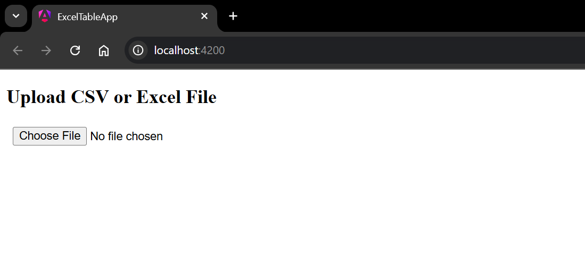
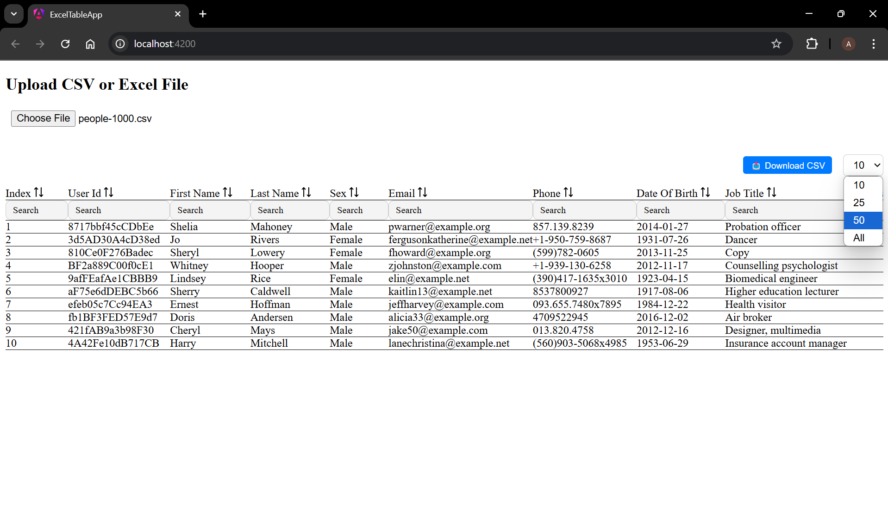
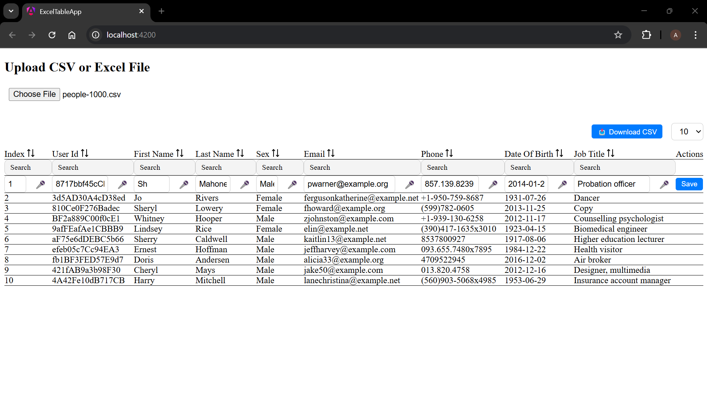
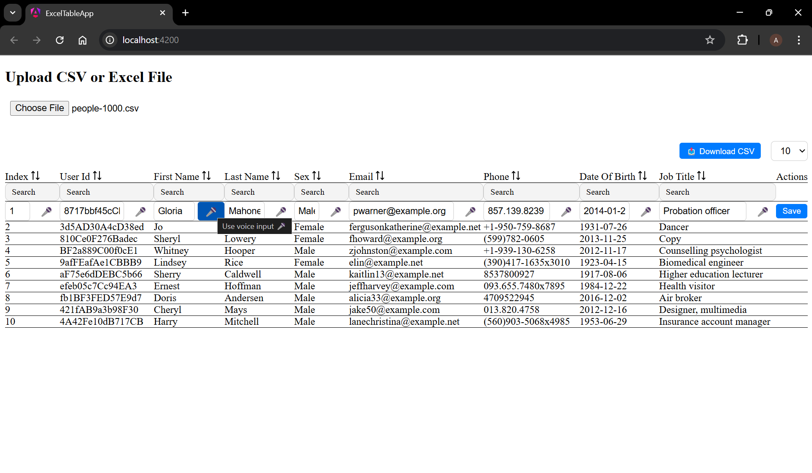
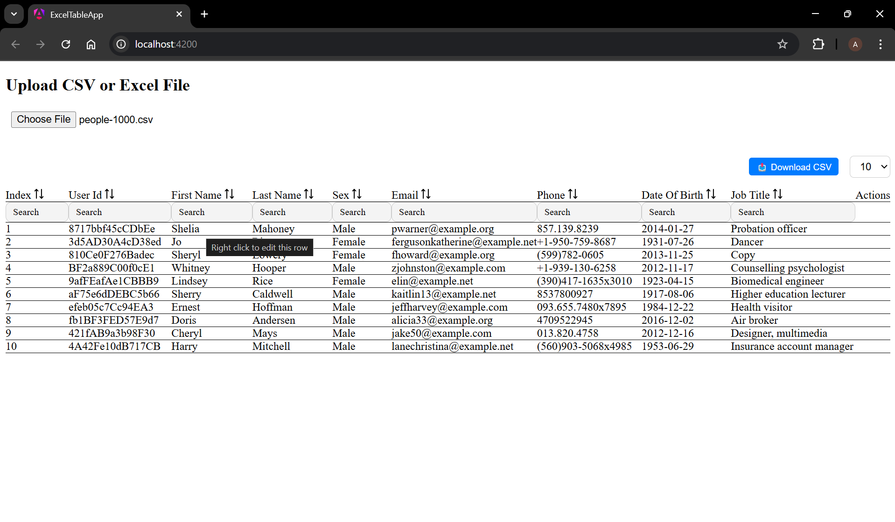
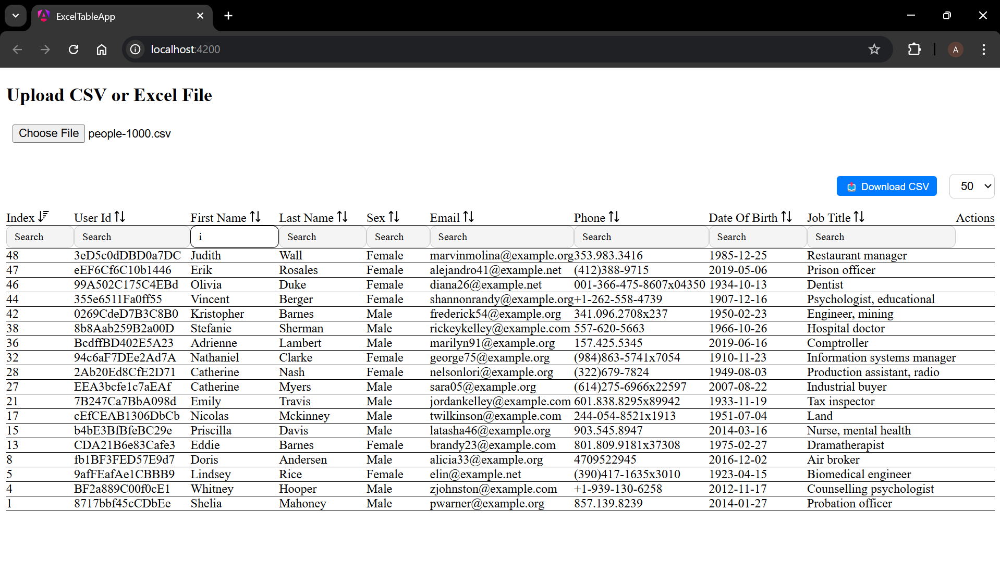
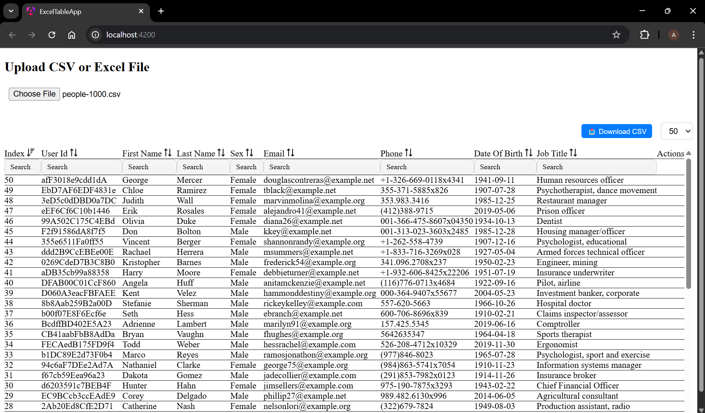
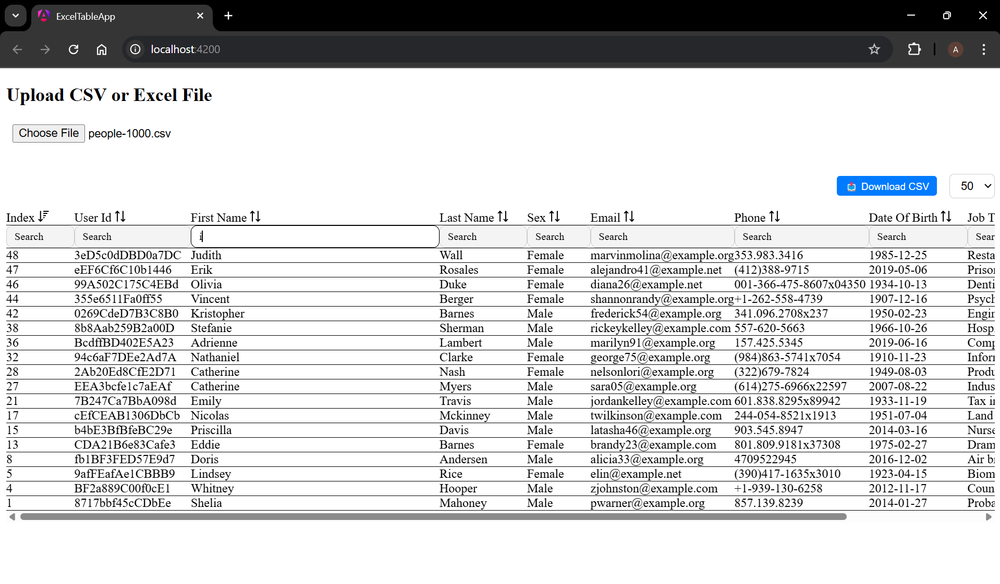
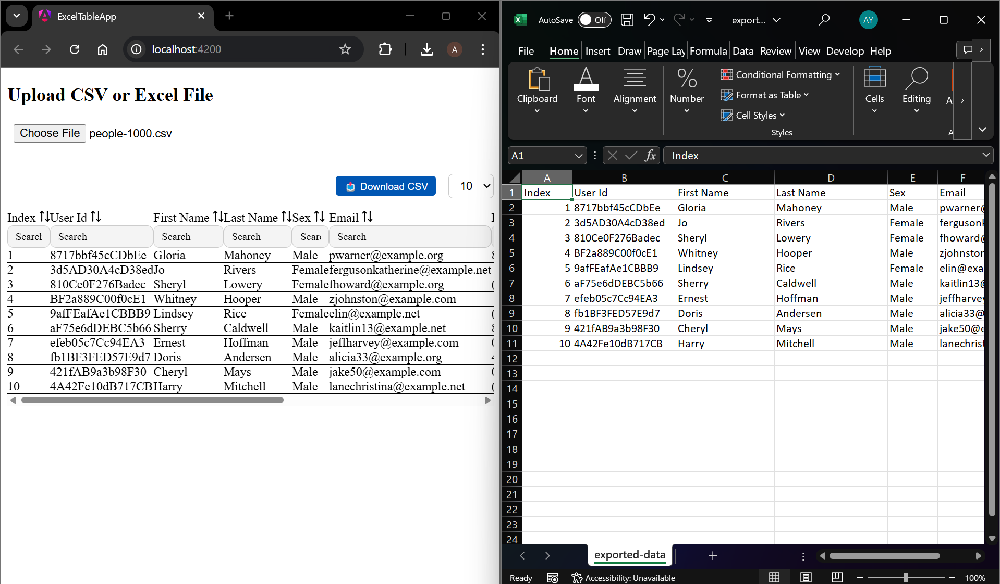
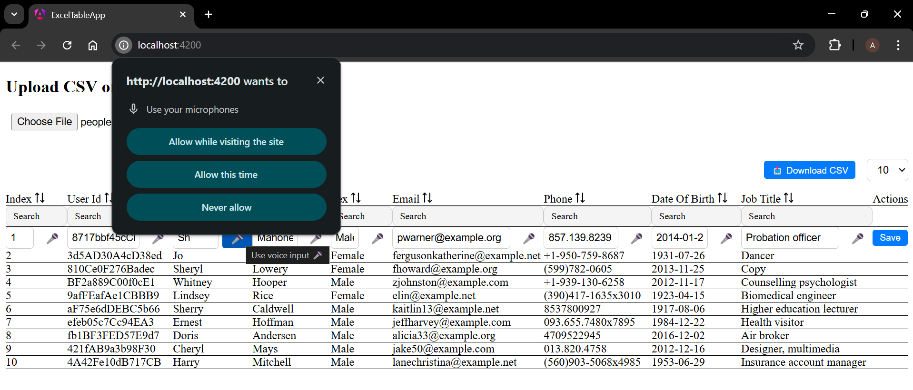

# 📊 Angular Dynamic Data Table

A dynamic and feature-rich data table built using Angular and PrimeNG. Upload files, edit rows, filter, sort, and even use your voice to input data.

---

## ✅ Features

- 📂 Upload CSV or Excel files (.csv, .xlsx)
- 🔍 Live column filtering
- 🔃 Sorting by text and number (custom)
- ✏️ Inline editing with right-click
- 🎤 Voice input (mic icon to dictate values)
- 📥 Download filtered data as CSV
- 📐 Column resizing

---

## 🖼️ Demo Screenshots

### 🔼 Upload and Structure
**Upload CSV or Excel Files**  


**Auto-Numbered Rows**  


---

### ✏️ Editing
**Edit Cell by Typing**  


**Edit Cell Using Voice Input**  


**Hover Tooltip for Editing Instructions**  


---

### 📊 Table Features
**Filter by Column**  


**Sort by Column**  


**Resize Table Columns**  


---

### 📥 Data Export
**Download Filtered Data as CSV**  


**Microphone Icon for Voice Input**  


---

## 🛠️ Tech Stack

- **Angular** (v15+ with Standalone Components)
- **PrimeNG** (UI Components)
- **PapaParse** (CSV parsing)
- **XLSX** (Excel support)
- **Web Speech API** (Voice input)

---

## 🚀 Running the App Locally

```bash
git clone https://github.com/YOUR_USERNAME/YOUR_REPO.git
cd YOUR_REPO
npm install
ng serve
